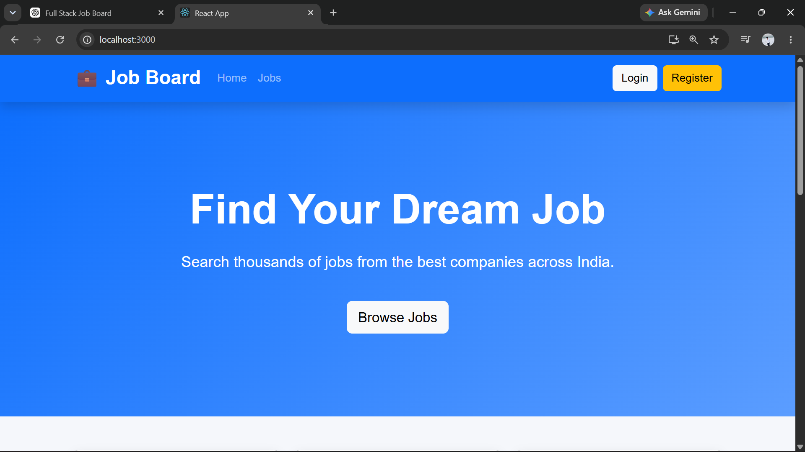
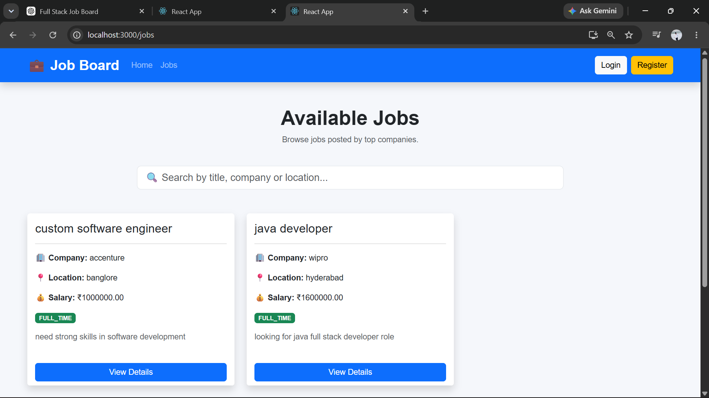
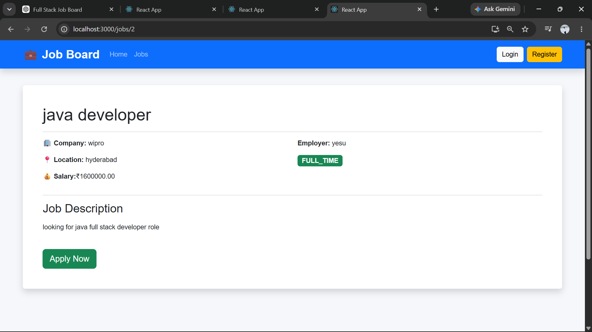
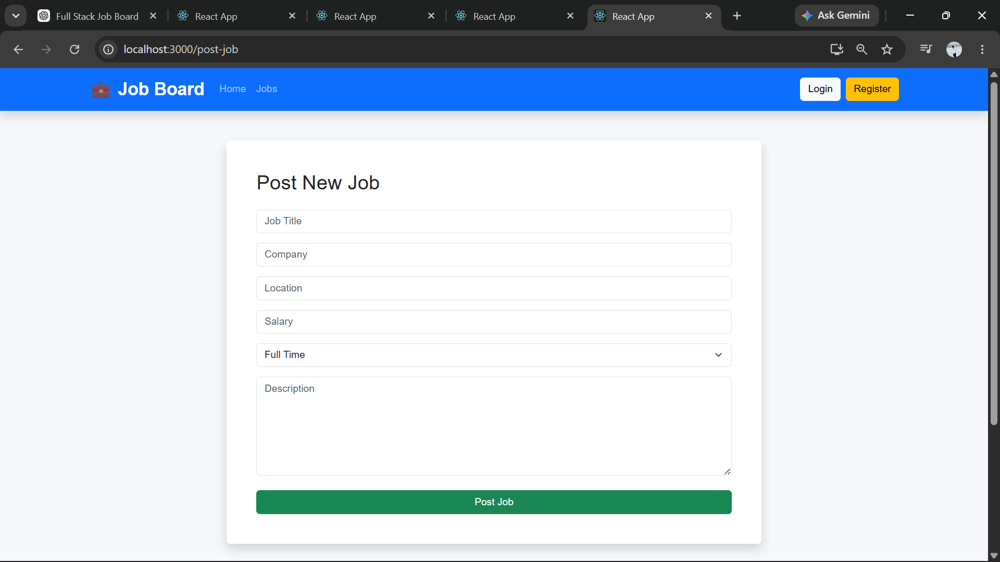
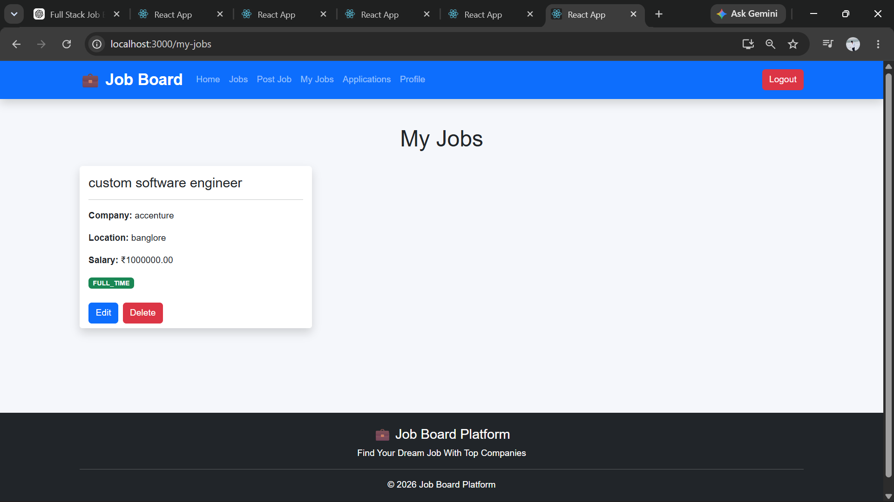
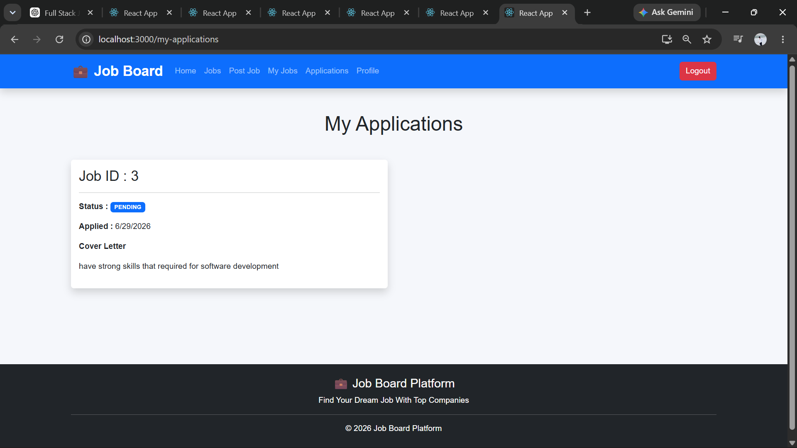

# Job Board Platform

## Overview

Job Board Platform is a full-stack web application developed using **React**, **Django REST Framework**, **PostgreSQL**, and **JWT Authentication**.

The application allows employers to post and manage job listings, while job seekers can browse available jobs and apply online.

---

## Features

### Authentication

* User Registration
* User Login
* JWT Authentication
* Logout

### Job Management

* Create Job
* View Jobs
* View Job Details
* Edit Job
* Delete Job
* View My Jobs

### Job Applications

* Apply for a Job
* View My Applications

---

## Technologies Used

### Frontend

* React
* React Router
* Axios
* Bootstrap

### Backend

* Python
* Django
* Django REST Framework
* Simple JWT

### Database

* PostgreSQL

---

## Project Structure

```text
JobBoardPlatform
│
├── backend
├── frontend
├── screenshots
├── README.md
```

---

## Installation

### Clone the Repository

```bash
git clone https://github.com/YOUR_GITHUB_USERNAME/JobBoardPlatform.git
```

### Backend Setup

```bash
cd backend

python -m venv venv

venv\Scripts\activate

pip install -r requirements.txt

python manage.py migrate

python manage.py runserver
```

Backend runs on:

```text
http://127.0.0.1:8000/
```

---

### Frontend Setup

```bash
cd frontend

npm install

npm start
```

Frontend runs on:

```text
http://localhost:3000/
```

---

## API Endpoints

### Authentication

* POST `/api/users/register/`
* POST `/api/token/`

### Jobs

* GET `/api/jobs/`
* POST `/api/jobs/`
* PUT `/api/jobs/{id}/`
* DELETE `/api/jobs/{id}/`

### Applications

* GET `/api/applications/`
* POST `/api/applications/`

---

## Testing

Run the following command:

```bash
python manage.py test
```

The project includes unit tests for the backend.

---

## Screenshots

### Home Page



---

### Job List



---

### Job Details



---

### Post Job



---

### My Jobs



---

### My Applications



---

## Future Improvements

* Email notifications
* Resume upload
* Company profiles
* Advanced job search
* Job categories

---

## Author

**Anand Kumar Badarala**

Full Stack Developer

---

## License

This project was developed for educational purposes as part of a Full Stack Capstone Assignment.
